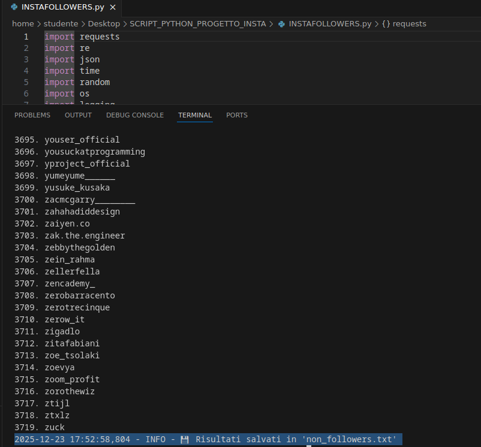
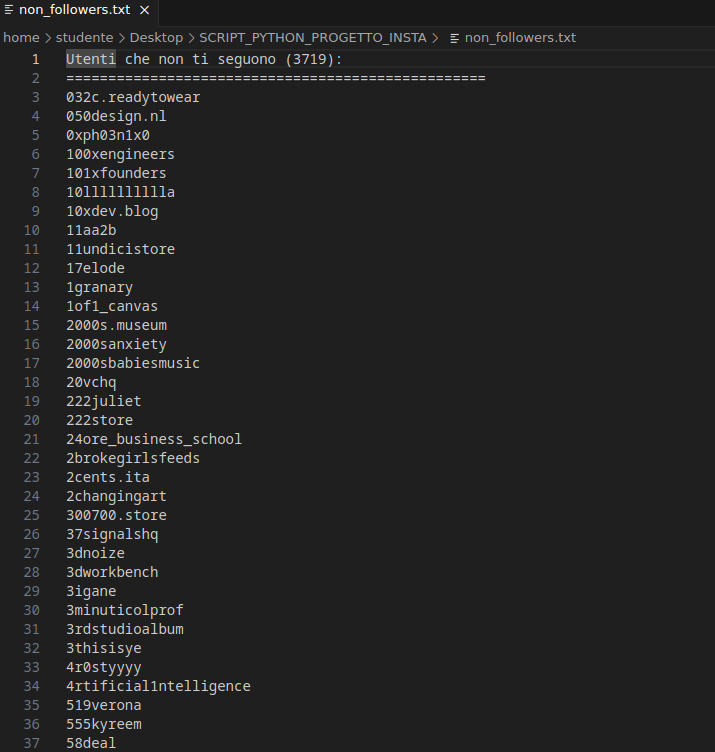

  

# UNFOLLOWERS_DETECTION_INSTAGRAM
Tecniche di Web Scraping per ottenere la lista di persone che seguiamo che a loro volta non ci seguono su Instagram.

Questo progetto nasce dall’esigenza di ottenere la lista degli account seguiti da un utente Instagram che non ricambiano il follow, evitando l’utilizzo di applicazioni di terze parti potenzialmente inaffidabili o invasive. È noto, infatti, che alcune di queste soluzioni richiedono credenziali sensibili o possono compromettere la sicurezza dell’account.
Oltre all’aspetto legato alla sicurezza, il progetto rappresenta anche un esercizio pratico di web scraping e analisi delle richieste HTTP, ambiti di particolare interesse personale.

**Logica di funzionamento**
Una volta ottenuto l’ID univoco di un account Instagram, il sistema interroga specifici endpoint per ottenere:
  -la lista dei followers;
  -la lista degli account seguiti (following).
Le due liste vengono successivamente confrontate al fine di individuare gli utenti che l’account di riferimento segue, ma dai quali non riceve il follow in cambio. Il risultato finale è quindi una lista filtrata di non-followers.

Una volta identificati gli endpoint necessari, il processo viene completamente automatizzato tramite richieste HTTP dirette ai server di Instagram.

**Gestione delle limitazioni e simulazione del comportamento umano**

Molti servizi impongono restrizioni o blocchi temporanei in presenza di un elevato numero di richieste consecutive provenienti dallo stesso client. Per ridurre il rischio di rate limiting o ban, come versoimilmente in questo caso, ho sfrutatto un template che mi era già costruito per un progetto simile, implementando le seguenti strategie:

  -introduzione di intervalli temporali (delay) tra una richiesta e la successiva;
  -invio delle richieste con User-Agent casuali, simulando browser e sistemi operativi differenti scelti in maniera random;
  -comportamento complessivo progettato per avvicinarsi il più possibile a quello di un utente umano reale.

Queste tecniche permettono di rendere il processo più robusto e meno invasivo, migliorando l’affidabilità dello scraping senza compromettere la sicurezza dell’account, aggirando le limitazioni citate prima. 

SETUP: 1. Serve un PC. 2. Poi lo username dell'utente, da cui parte la prima richiesta per ottenerne l'ID (ragionevolmente una Primary Key che funge da Foreign Key per i suoi follower e seguiti), che ci permette poi di mandare richieste per ottenere lista followers e seguiti dato l'ID dell'utemte di nostro interesse, per poi compararle in un secondo momento.

3. Infine il **COOKIE della sessione (Session ID)**  
   *(vedi il video sopra per riferimento visivo)*

   - Dal PC, accedere a Instagram e aprire il profilo di interesse
   - Premere `Ctrl + Shift + C` (Windows) oppure `Cmd + Option + C` (Mac)
   - Si apre DevTools → ricaricare la pagina → sezione **Network**
   - Sotto **Name**, cliccare il primo risultato (`usernameutente/`)
   - Aprire **Headers**
   - In **Request Headers**, copiare il valore **Cookie**
   - Incollare la stringa nel programma quando richiesto in input

**NB**: CHIARAMENTE c'è bisogno di un IDE, magari Visual Code, un interprete Python e le librerie necessarie indicate negli "import", scaricabili tramite il Package Manager.

Ovviamente basta runnare il programma, inserire username utente desiderato e COOKIE come spiegato sopra e poi l'algoritmo farà il resto. Alla fine del programma, comparirà un file .txt che potete salvare, in cui saranno visibili gli utenti che seguite ma che non vi seguono! Il file lo troverete nella stessa cartella dello script.
(foto dimostrative in basso).

---

  
Clicca per vedere le immagini

   

  
    
  

